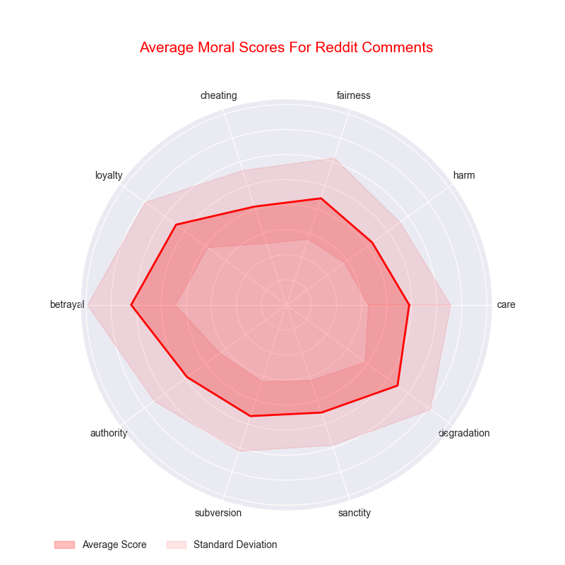
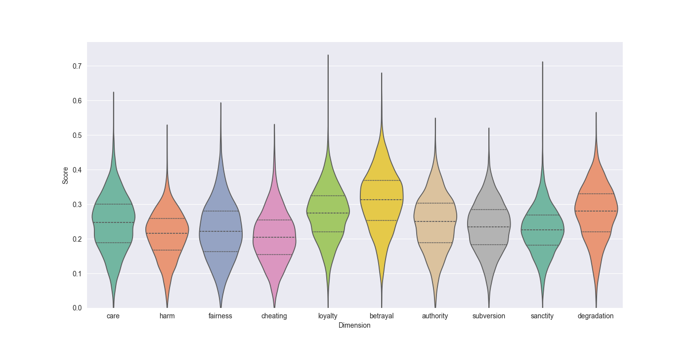

# Reddit Comment Moral Analysis

This repository provides a comprehensive solution for analyzing and evaluating comments from top Reddit posts, specifically from the `r/politics` subreddit. The project focuses on assessing the moral dimensions of comments using advanced text processing and machine learning techniques.

## Key Components:
- **DataGatherer**: Gathers and organizes comments from Reddit posts.
- **Preprocessing**: Cleans and processes text data.
- **MoralCentroids**: Calculates moral scores using custom vectors and embeddings.
- **MoralScoreAnalyzer**: Analyzes and visualizes moral scores with statistical and graphical methods.

## Usage
1. Clone the repository.
2. Run `pip3 install -r requirements.txt`.
3. Get your credentials from [Reddit](https://www.reddit.com/prefs/apps) and add them to `credentials.py`.
4. Edit `config.py`.
5. Run `python main.py`.

This project is ideal for those interested in text analysis, sentiment evaluation, and moral dimension analysis of social media content.

